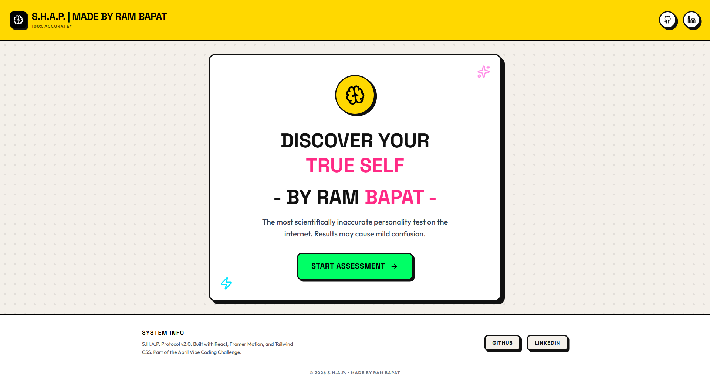
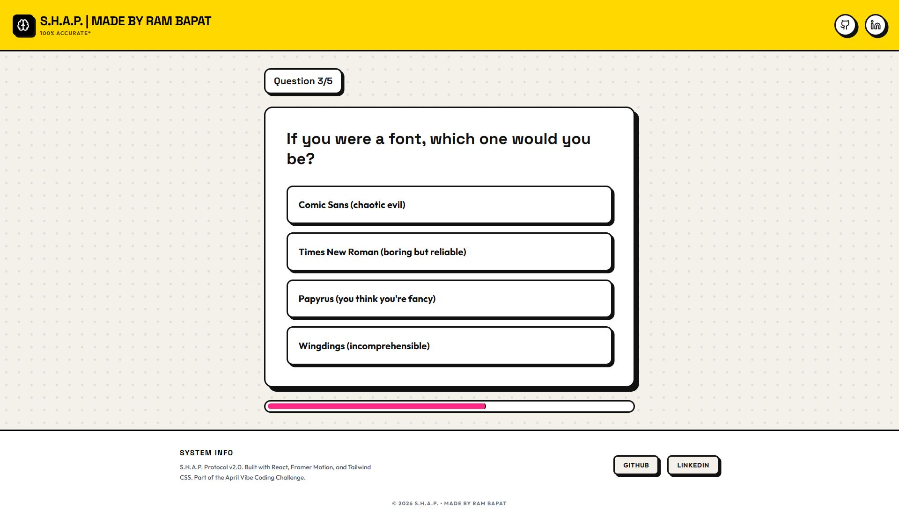
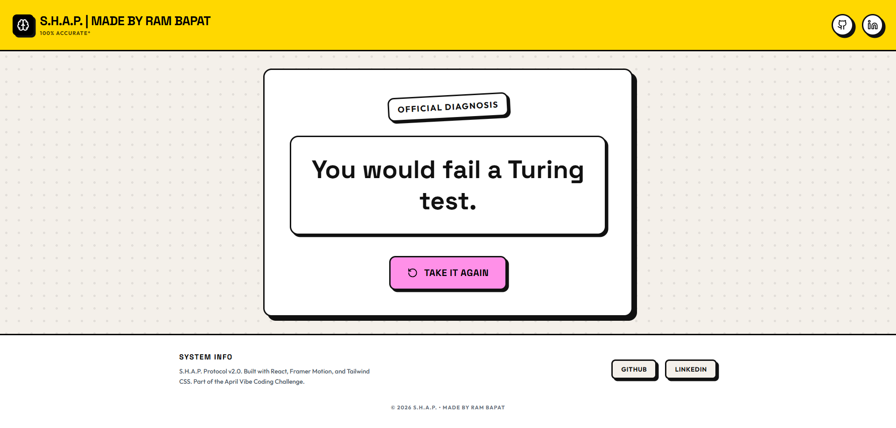

# 🧪 S.H.A.P. Assessment: The Ultimate Personality Test

    

**Day 15 / 30 - April Vibe Coding Challenge**

## Live Demo on Vercel - [Demo](https://ink-and-error-hangman.vercel.app/)

**S.H.A.P.** (Standardized Human Assessment Protocol) is a highly scientific, completely infallible, and utterly absurd personality test. It asks the hard questions (like how many toddlers you could fight in zero gravity) to give you the answers you never knew you needed.

## 📸 Screenshots


*The elegant start menu.*


*Active gameplay.*


*Final Result Screen.*

## ✨ Features

*   **🧠 Absurd Logic:** Over 50 weird, hand-crafted questions and 30 hilarious results.
*   **🎨 Neo-Brutalist UX:** Designed with loud colors, thick borders, and hard shadows for a playful, chaotic, modern web aesthetic.
*   **🎭 Bouncy Animations:** Powered by Framer Motion for seamless, springy transitions between questions.
*   **📊 Fake Analysis:** A highly realistic (but totally fake) progress bar that "analyzes" your potato metrics.
*   **📱 Fully Responsive:** Optimized for mobile, tablet, and desktop.

## 🛠️ Tech Stack

*   **Frontend Framework:** React 19 + Vite
*   **Styling:** Tailwind CSS 4 (Custom Neo-Brutalist Theme)
*   **Animations:** Framer Motion (`motion/react`)
*   **Icons:** Lucide React

## 🚀 Getting Started

### 1. Clone the Repository
```bash
git clone https://github.com/Barrsum/SHAP-Assessment.git
cd SHAP-Assessment
```

### 2. Install Dependencies
```bash
npm install
```

### 3. Run the App
```bash
npm run dev
```

## 👤 Author

**Ram Bapat**
*   [LinkedIn](https://www.linkedin.com/in/ram-bapat-barrsum-diamos)
*   [GitHub](https://github.com/Barrsum)

---
*Part of the April 2026 Vibe Coding Challenge.*
